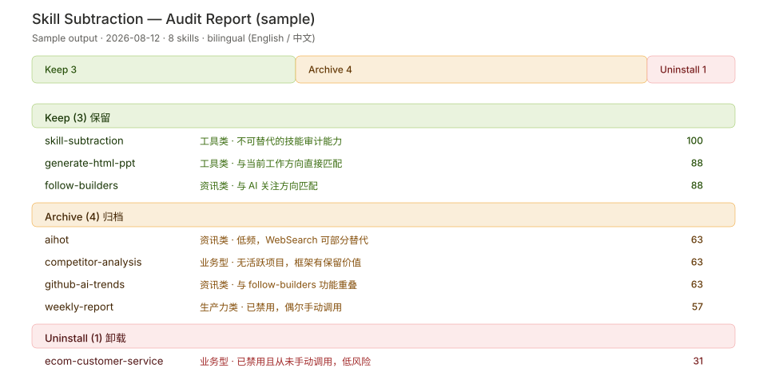

# skill-subtraction

[](LICENSE)
[](scripts/audit_skills.py)
[](#installation)

> The core of AI skill management is "lean and focused," not "more is better."

A systematic audit tool for installed AI skills. It scans every installed skill, evaluates value by category, and generates structured **keep / archive / uninstall** recommendations to keep your skill set lean and efficient.

Inspired by Swyx (Latent Space host / smol.ai founder): most people keep adding skills until dozens pile up — and few ever get used.

## Demo



See real generated samples: [English report](examples/audit_report_en.md) · [中文报告](examples/audit_report_zh.md)

## Why subtraction?

| Problem | Description |
|---------|-------------|
| **Cognitive overload** | More skills = higher selection cost, defeating the purpose of efficiency |
| **Judgment interference** | Outdated skills act as noise, clouding decisions on new problems |
| **High maintenance cost** | Skills need updates and debugging; too many means wasted effort |

## Features

- **Agent Skills standard compliant** — strictly adheres to frontmatter specifications (`name` and `description` top-level, non-standard fields in `metadata:` or body) with English-primary, bilingual trigger descriptions for reliable cross-platform execution (Codex, Claude Code, Cursor, WorkBuddy, etc.)
- **Auto-scan** — detects the hosting agent platform from its own path (`~/.workbuddy/skills/` → WorkBuddy, `~/.codex/skills/` → Codex, …), scans all installed skills, plus project-level skills in the workspace
- **Bilingual output** — Chinese or English reports via `--lang zh` / `--lang en`; stderr, issue descriptions, and report templates fully localized
- **Multi-platform** — WorkBuddy, Codex, Claude Code, Cursor, Cline, Continue, LobsterAI, and anything following the `~/.<agent>/skills/` convention; `--all` scans every installed platform
- **Score-based evaluation** — classifies skills (tool / business / news / productivity) and scores each on 6 weighted metrics (usage frequency, necessity, current relevance, enabled status, maintenance, unique value)
- **Smart recommendations** — keep / archive / uninstall with special rules: dedup, disabled-skill detection, project-end detection, batch-install detection
- **Safe cleanup** — archives save skill configs first; uninstall only executes after explicit user confirmation

## Installation

Requires Python 3.10+ and an agent that follows the `~/.<agent>/skills/` directory convention.

| Agent | Command |
|-------|---------|
| **Codex** (in-session installer) | `/skill-installer install https://github.com/helloyxs/skill-subtraction` |
| **Claude Code** | `cp -r skill-subtraction ~/.claude/skills/` |
| **Cursor** | `cp -r skill-subtraction ~/.cursor/skills/` |
| **WorkBuddy** | `cp -r skill-subtraction ~/.workbuddy/skills/` |
| Any agent (clone) | `git clone https://github.com/helloyxs/skill-subtraction ~/.<agent>/skills/skill-subtraction` |

> Cursor also auto-loads `~/.claude/skills/` and `~/.codex/skills/`, so one copy can serve multiple agents.

## Usage

Just say (English or 中文):

- "Audit my installed skills" / "帮我检查一下装了哪些技能"
- "Do a skill subtraction" / "做一次技能减法"
- "Which skills should I keep or delete?" / "哪些技能该留、哪些该删"
- "Clean up my skills" / "审计我的技能"

The skill auto-triggers and runs a 5-step workflow:

1. **Scan** — `python3 scripts/audit_skills.py --lang <zh|en>` collects metadata for all installed skills (batch-install detection, install-source stats)
2. **Classify** — tool / business / news / productivity / platform-preinstalled; identify install source (user / platform / agent-created)
3. **Evaluate** — 6 weighted metrics, composite score 24–100
4. **Recommend** — keep / archive / uninstall report (language follows the conversation)
5. **Cleanup** — only after user confirmation (archive saves config first)

### Run the scan script directly

```bash
python3 scripts/audit_skills.py              # user-level skills (Chinese, default)
python3 scripts/audit_skills.py --lang en    # English output
python3 scripts/audit_skills.py --agent codex
python3 scripts/audit_skills.py --all        # scan all installed platforms
python3 scripts/audit_skills.py --workspace /path/to/workspace
python3 scripts/audit_skills.py --skills-dir "C:\Users\admin\AppData\Roaming\LobsterAI\SKILLs"
```

Output is a JSON array; each entry includes `name`, `agent`, `scope`, `path`, `description`, `agent_created`, `has_scripts`, `has_references`, `file_count`, `dir_size`, `last_modified`, `version`, plus `source_stats` and `batch_installs`. Exit codes: 0 = clean, 2 = scan done with error-level issues (CI-friendly).

## Evaluation framework

| Composite score | Recommendation | Description |
|----------------|----------------|-------------|
| 80–100 | Keep | High-value, master it deeply |
| 50–79 | Archive | Save config, uninstall, re-activate when needed |
| 24–49 | Uninstall | Low value, clean up directly |

Special rules (override scoring): zero usage + irrelevant → uninstall · complete overlap → keep the best one (dedup) · disabled & never invoked → uninstall · project ended → uninstall · platform-preinstalled + never triggered → archive.

Full framework (classification, 6-metric scoring detail, dedup priority, archive standard) in [`references/evaluation_framework.md`](references/evaluation_framework.md).

## Audit cycle

| Frequency | Scenario |
|-----------|----------|
| Quarterly | When skill count exceeds 10 |
| After each project ends | Clean up project-level skills |
| When business direction shifts | Re-evaluate business-type skills |
| When feeling "too many skills" | Anytime |

## Directory structure

```
skill-subtraction/
├── SKILL.md                          # Skill definition (workflow + triggers)
├── LICENSE                           # MIT License
├── README.md                         # English README
├── README_zh.md                      # 中文说明
├── agents/
│   └── openai.yaml                   # Codex marketplace manifest
├── assets/
│   └── demo-report.svg               # Demo screenshot
├── examples/
│   ├── audit_report_en.md            # Sample English report
│   └── audit_report_zh.md            # 中文示例报告
├── scripts/
│   └── audit_skills.py               # Scan script, outputs structured JSON
└── references/
    └── evaluation_framework.md       # Full evaluation framework
```

## License

[MIT](LICENSE)
